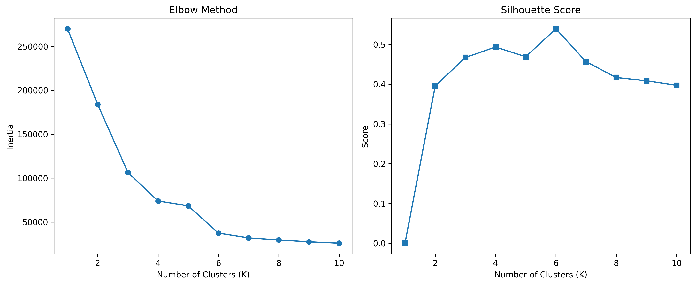
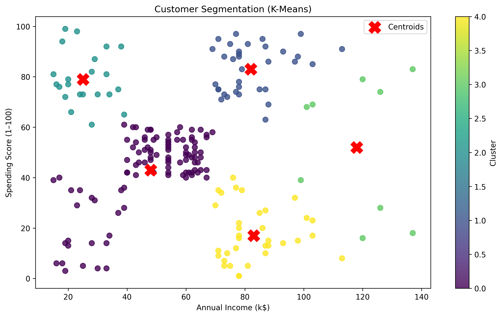

# K-Means Customer Segmentation (From Scratch)

K-Means implemented from scratch for customer segmentation using income and spending score.

---

## Run

```bash
python -m src.main
```

---

## Dataset

* Mall Customers
* Features:

  * Annual Income (k$)
  * Spending Score (1–100)

---

## Results

### Elbow & Silhouette



### Clusters



---

## Method

* K-Means++ initialization
* Euclidean distance
* Centroid shift convergence

---

## Summary

K = 5 yields clear segments:

* High income / high spending
* High income / low spending
* Average
* Low income / high spending
* Low income / low spending

---

## Structure

```bash
src/
  algorithms/
  evaluation/
  visualization/
  utils/
  main.py
```

---

## Notes

* Scratch implementation (no sklearn for training)
* Includes sklearn comparison
* Not optimized (loop-based)

---
